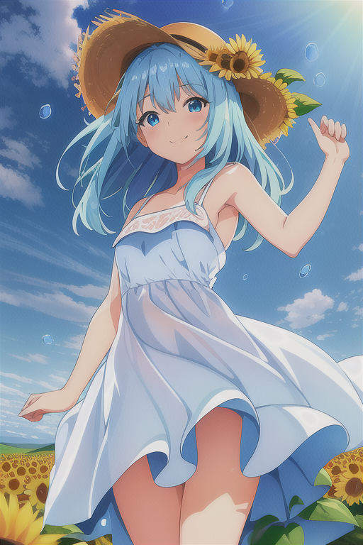
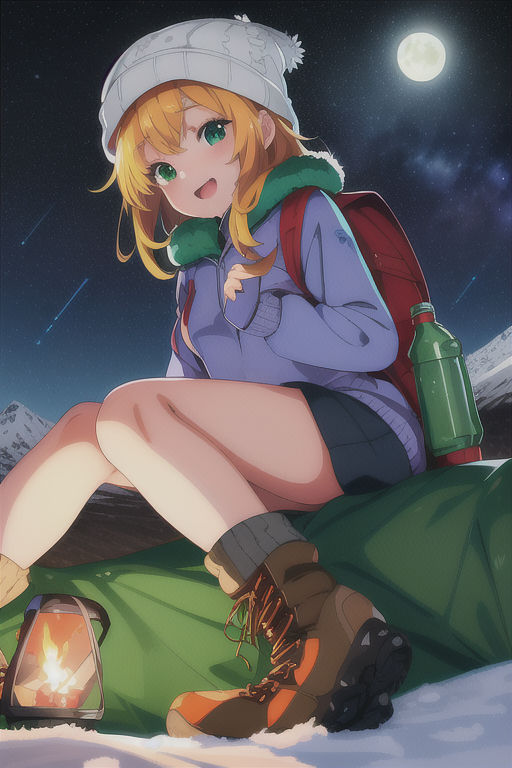
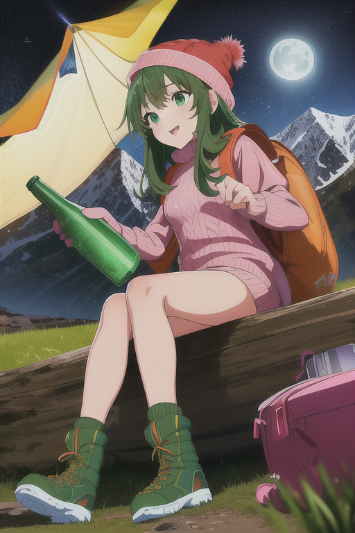

# stable-diffusion

### How to build

```
$ gcc -O3 -DNDEBUG -march=native -mavx -mf16c -msse3 -ffast-math -fno-omit-frame-pointer -c ggml.c
$ g++ -o sd -O3 main.cpp stable-diffusion.cpp ggml.o
```

### How to convert the model

```
$ wget https://huggingface.co/OedoSoldier/ambientmix/resolve/main/ambientmix-half.safetensors
$ python3 convert.py ambientmix-half.safetensors --out_type f16
```

### How to use

```
$ ./sd 
error: the following arguments are required: prompt
usage: ./sd [arguments]

arguments:
  -h, --help                         show this help message and exit
  -M, --mode [txt2img or img2img]    generation mode (default: txt2img)
  -t, --threads N                    number of threads to use during computation (default: -1).
                                     If threads <= 0, then threads will be set to the number of CPU physical cores
  -m, --model [MODEL]                path to model
  -i, --init-img [IMAGE]             path to the input image, required by img2img
  -o, --output OUTPUT                path to write result image to (default: .\output.png)
  -p, --prompt [PROMPT]              the prompt to render
  -n, --negative-prompt PROMPT       the negative prompt (default: "")
  --cfg-scale SCALE                  unconditional guidance scale: (default: 7.0)
  --strength STRENGTH                strength for noising/unnoising (default: 0.75)
                                     1.0 corresponds to full destruction of information in init image
  -H, --height H                     image height, in pixel space (default: 512)
  -W, --width W                      image width, in pixel space (default: 512)
  --sample-method SAMPLE_METHOD      sample method (default: "eular a")
  --steps  STEPS                     number of sample steps (default: 20)
  -s SEED, --seed SEED               RNG seed (default: 42, use random seed for < 0)
  -v, --verbose                      print extra info

$ ./sd -p "illustration, (high resolution)++, 8k+, attractive, highly detailed, symmetry eyes, pretty Japanese girl, 15yo, small breasts, solo, outdoors, camping, night, mountains, nature, stars, moon, tent, twin ponytails, green eyes, cheerful, happy, backpack, sleeping bag, camping stove, water bottle, mountain boots, gloves, sweater, hat, flashlight, forest, rocks, river, wood, smoke, shadows, contrast, clear sky, constellations, Milky Way, peaceful, serene, quiet, tranquil, remote, secluded, adventurous, exploration, escape, independence, survival, resourcefulness, challenge, perseverance, stamina, endurance, observation, intuition, adaptability, creativity, imagination, artistry, inspiration, beauty, awe, wonder, gratitude, appreciation, relaxation, enjoyment, rejuvenation, mindfulness, awareness, connection, harmony, balance, texture, detail, realism, depth, perspective, composition, color, light, shadow, reflection, refraction, tone, contrast, foreground, middle ground, background, naturalistic, figurative, representational, impressionistic, expressionistic, abstract, innovative, experimental, unique" -n "paintings, sketches, (worst quality:2), (low quality:2), (normal quality:2), lowres, ((monochrome)), ((grayscale)), skin spots, acnes, skin blemishes, age spot, manboobs, (backlight:1.2), double navel, mutad arms, hused arms, bad architecture, text, (logo), (watermark)" --steps 20 --cfg-scale 7 -W 512 -H 768 -m ambientmix-half-ggml-model-f16.bin -o mountain.png -s 10

$ ./sd -p "illustration, (high resolution)++, 8k+, attractive, highly detailed, symmetry eyes, pretty Japanese girl, 15yo, small breasts, (from below dutch angle:1.2), sunflower field scenery, blue sky, rainbow, water drop, cutie girl wearing simple white dress, straw hat on head, floating hair, wind, smile, (depth of field:1.3), (lens flare:1.1)," -n "paintings, sketches, (worst quality:2), (low quality:2), (normal quality:2), lowres, ((monochrome)), ((grayscale)), skin spots, acnes, skin blemishes, age spot, manboobs, (backlight:1.2), double navel, mutad arms, hused arms, bad architecture, text, (logo), (watermark)" --steps 20 --cfg-scale 7 -W 512 -H 768 -m ambientmix-half-ggml-model-f16.bin -o sunflower.png -s 10
```

### Samples










### ref.

* https://github.com/leejet/stable-diffusion.cpp
